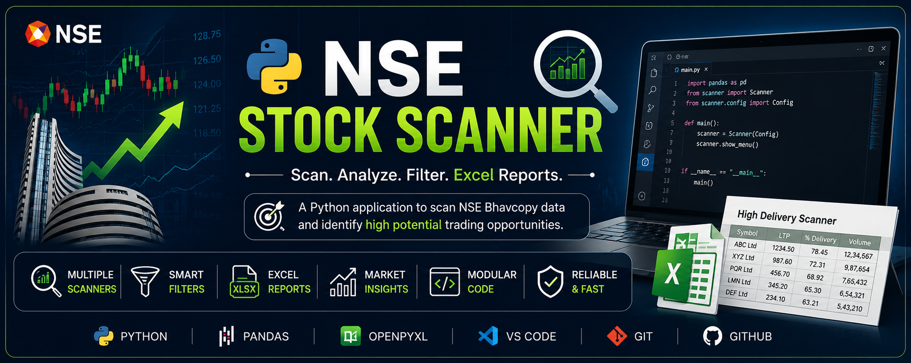

<p align="center">
  
</p>

# 📈 NSE Stock Scanner
# 📈 NSE Stock Scanner

A Python-based NSE Stock Scanner developed to analyze daily NSE Bhavcopy data and identify trading opportunities using different stock screening strategies.

---

## 🚀 Features

The scanner currently supports the following filters:

- ✅ High Delivery Scanner
- ✅ High Volume Scanner
- ✅ Gap Up Scanner
- ✅ Gap Down Scanner
- ✅ Bullish Candle Scanner
- ✅ Bearish Candle Scanner
- ✅ High Delivery + High Volume Scanner
- ✅ Gap Up + High Volume Scanner

---

## 📂 Project Structure

```
NSE_Stock_Scanner/
│
├── Data/
│   ├── bhavcopy.csv
│   ├── delivery.csv
│   └── sec_bhavdata_full_24062026.csv
│
├── Output/
│
├── scanner/
│   ├── config.py
│   ├── data_loader.py
│   ├── filters.py
│   ├── logger.py
│   ├── reports.py
│   ├── utils.py
│   └── __init__.py
│
├── main.py
├── requirements.txt
└── README.md
```

---

## ⚙️ Technologies Used

- Python 3
- Pandas
- OpenPyXL
- Git
- GitHub

---

## 📦 Installation

Clone the repository:

```bash
git clone https://github.com/indxrrr80/NSE-Stock-Scanner.git
```

Move into the project folder:

```bash
cd NSE-Stock-Scanner
```

Install dependencies:

```bash
pip install -r requirements.txt
```

---

## ▶️ Run the Project

```bash
python main.py
```

---

## 📊 Available Scanners

| Scanner | Description |
|----------|-------------|
| High Delivery | Finds stocks with high delivery percentage |
| High Volume | Finds stocks with unusually high traded volume |
| Gap Up | Finds stocks opening significantly above previous close |
| Gap Down | Finds stocks opening significantly below previous close |
| Bullish Candle | Finds stocks closing above opening price |
| Bearish Candle | Finds stocks closing below opening price |
| High Delivery + High Volume | Combines delivery and volume filters |
| Gap Up + High Volume | Combines gap up and volume filters |

---

## 📁 Output

The scanner generates Excel reports inside the `Output` folder.

Example:

- High_Delivery.xlsx
- High_Volume.xlsx
- Gap_Up.xlsx
- Gap_Down.xlsx
- Bullish_Candles.xlsx
- Bearish_Candles.xlsx

---

## 🔮 Future Improvements

- Technical Indicators (RSI, EMA, SMA)
- Candlestick Pattern Detection
- Multi-Day Analysis
- Automatic Daily Data Download
- Interactive Dashboard
- Better Logging
- Unit Testing

---

## 👨‍💻 Author

**Inder Mohindra**

B.Tech Computer Science Engineering

UPES, Dehradun

---

## ⭐ If you found this project useful, consider giving it a star!